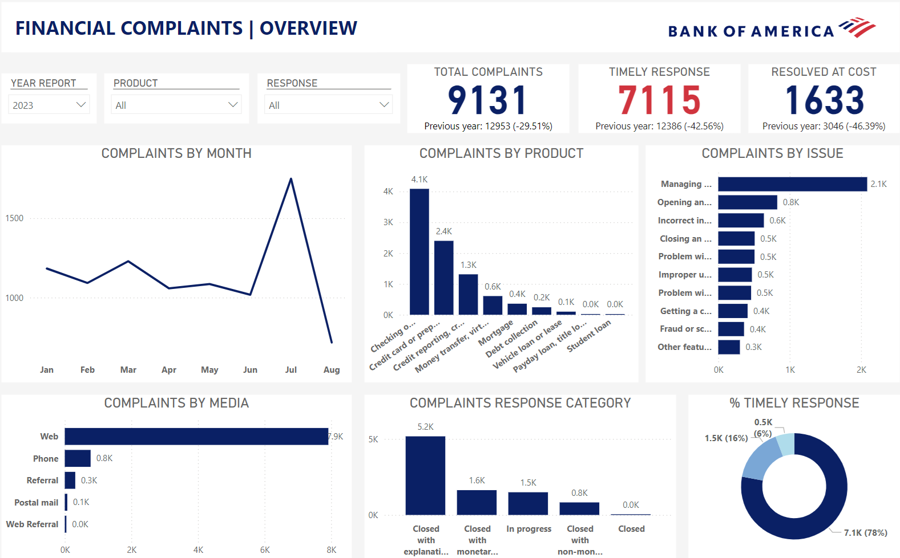

# Improve products and services quality at Bank of America by analyzing financial customer complaints

# Overview:
1. Project Name
2. Summary
3. Data source
4. Tools and analysis method
5. Implementation
6. Dashboard
7. Results and Findings
8. Conclusion
9. Recommendations
10. References

# 1. Project Name:

**Improve products and services quality at Bank of America by analyzing financial customer complaints**

# 2. Summary:

The project aims to build report to track numbers and trends of customer complaints by each category. From there, make suggestions to improve the quality of products and services for the Bank.

# 3. Data source:

Customer complaints data on financial products & services at Bank of America for the period from 2017 to 2023. The data set has 62,516 rows, including the dates the complaint was submitted to the CFPB and then sent to the company, the product and issue mentioned in the complaint, and the company's response.
- *Source: [Consumer Financial Protection Bureau](https://www.consumerfinance.gov/language/vi/)*
- *Collecting and clean data: [mavenanalytics.io](https://www.mavenanalytics.io/data-playground?page=2&pageSize=5)*

# 4. Tools and analysis method:

- Tools:
  * Excel: Exploring Data
  * Power BI: Creating Dashboard
- Analysis method: Descriptive analytics – using historical data to identify trends

# 5. Implementation:

- Collecting Data: Use cleaned data on mavenanalytics.
- Analyze: Analyze trends, find information related to the products with the most complaints, and come up with solutions to solve that problem.
- Data visualization: Create a dashboard to track the number of financial complaints over the year with the following categories: complaints by month, complaints by product, complaints by issue, complaints by media, complaints response category and timely response rate

# 6. Dashboard:

## Dashboard video
https://github.com/user-attachments/assets/3e5ed9af-dd54-4e28-9168-58aca15a5df3

# 7. Results and Findings

- The number of **customer complaints tends to increase over the years**.
- In the entire period from 2017 to 2023, **July tends to receive the most complaints**, up to nearly 6,500 complaints (accounting for more than 10% of the total number of complaints for the whole period).
- **Checking or Savings accounts** are the products that receive the most complaints from customers, followed by credit cards.
- **Managing an account** is the **most common issue** customer faced and all complaints about this issue come from customers using the checking or saving account product. According to research, customers often complaints that funds were taken from their accounts through **unauthorized or fraudulent transactions**.
- Customers complain the most via **Website** (accounting for more than 70%).
- The Bank **resolves complaints mainly with explanations** (accounting for more than 65%).
- The bank's **on-time complaint response rate was high**, recording over 93% for the entire period.

# 8. Conclusion

- Complaints about products and services at Bank of America tend to increase over the years, with the Checking or Saving account product having the most dissatisfactions. The problem that most consumers encounter is unauthorized transactions.

# 9. Recommendations

- The bank must **create and deploy software to detect and prevent unauthorized card transactions**, driven by the growing adoption of cashless payments among all players in the digital economy.

# 10. References:

- Consumer Financial Protection Bureau. (2023). Consumer Response Annual Report 2023. New York: Consumer Financial Protection Bureau.

